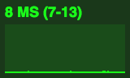

# MMM-FF-StatsJS

This [MagicMirror²](https://github.com/MichMich/MagicMirror) module, shows [Ricardo Cabello's](https://twitter.com/mrdoob) classic frontend [stats.js](https://github.com/mrdoob/stats.js/).





## Installation

Navigate into your MagicMirror's `modules` folder and clone:

```sh
git clone https://github.com/shin10/MMM-FF-StatsJS
```

Optionally/Recommended run `npm install` in the cloned directory. If you don't install it the code will load a fallback from github.

## Using the module

To use this module, add it to the modules array in the `config/config.js` file:

```javascript
modules: [
  {
    module: "MMM-FF-StatsJS",
    position: "bottom_right",
    config: {
      screens: [0, 1, 2],
      screenIdx: 0,
      rotationInterval: 10000,
      animationSpeed: 0,
      static: true
    }
  }
];
```

## Configuration options

The following properties can be configured:

| Option             | Default              | Expected                     | Description                                                  |
| ------------------ | -------------------- | ---------------------------- | ------------------------------------------------------------ |
| `screens`          | `[0, 1, 2]`          | array with numbers `0` - `3` | The screens to show.                                         |
| `screenIdx`        | `0`                  | `0` - `4`                    | The initial screen.                                          |
| `rotationInterval` | `10000` (10 seconds) | `null` or `int`              | The delay before automatically switching to the next screen. |
| `animationSpeed`   | `0` (no transition)  | `0` - `5000`                 | Speed of the update animation. (Milliseconds)                |
| `static`           | `true`               | `boolean`                    | This toggles the position between `fixed` and `static`       |
